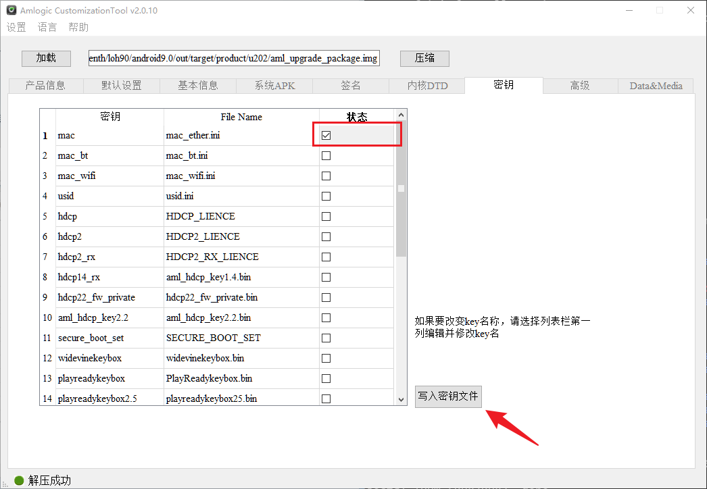
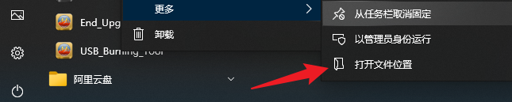
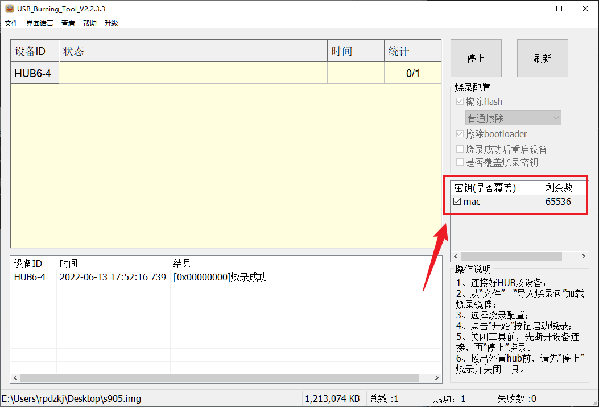

## 以 S905 为例：

1. 修改 SDK 代码：
~~~git
iff --git i/bootloader/uboot-repo/bl33/board/amlogic/configs/g12a_u202_v1.h w/bootloader/uboot-repo/bl33/board/amlogic/configs/g12a_u202_v1.h
index 4ad4e61ad0..806a4a0834 100755
--- i/bootloader/uboot-repo/bl33/board/amlogic/configs/g12a_u202_v1.h
+++ w/bootloader/uboot-repo/bl33/board/amlogic/configs/g12a_u202_v1.h
@@ -701,9 +701,8 @@
 #endif

 /* Choose One of Ethernet Type */
-#define CONFIG_ETHERNET_NONE
-#undef ETHERNET_INTERNAL_PHY
-#undef ETHERNET_EXTERNAL_PHY
+#undef CONFIG_ETHERNET_NONE
+#define ETHERNET_INTERNAL_PHY

 #define CONFIG_CMD_AML_MTEST 1
 #if defined(CONFIG_CMD_AML_MTEST)
~~~

2. 下载网盘的**05-工具/客制化工具**，并根据目录下的使用说明安装客制化工具
3. 参考客制化软件文档进行如下操作
  

4. 打开烧写工具位置
   

5. 在安装目录下的 license 文件下放置以下文件
  

6. 烧写镜像，勾选 MAC 密钥覆盖
   

7. MAC 地址查看
   

> mac_ether.ini 文件内容
>
> ~~~ini
> [Group1]
> start = 02:E1:E2:35:40:70
> end = 02:E1:E2:36:40:70
> total = 65536
> used = 1
> current = 02:E1:E2:35:40:70
> 
> 
> [fragment]
> fragment = 
> 
> ~~~
>
> MAC地址有格式要求，不符合格式的MAC地址，则会烧写无效
